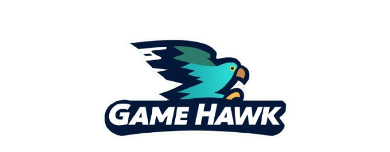
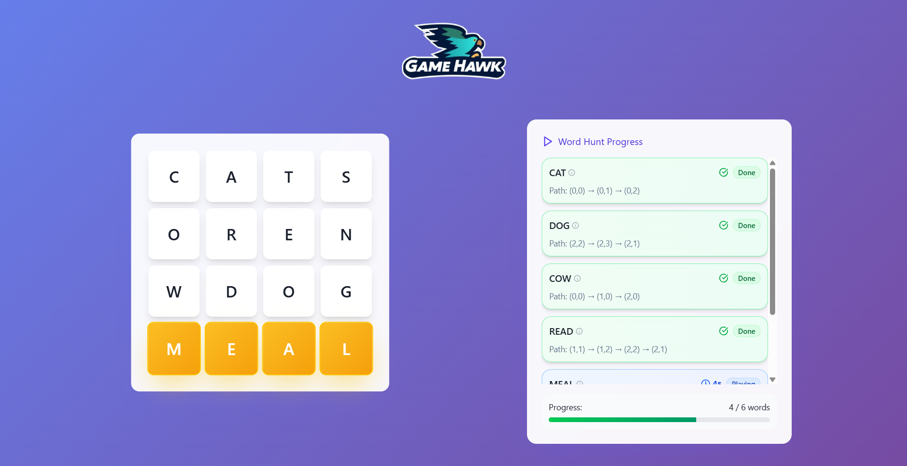
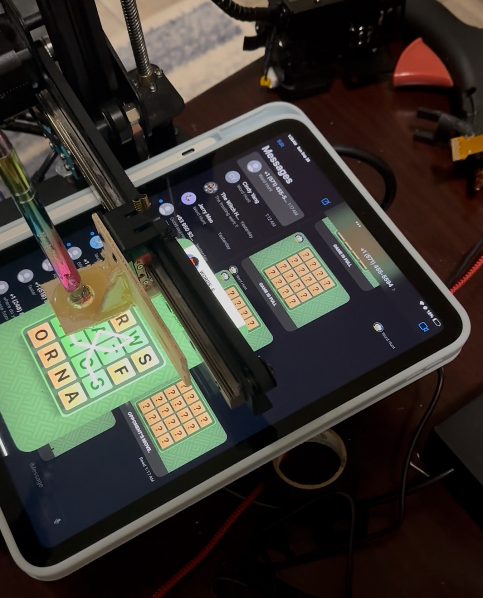

<!-- PROJECT LOGO -->
 

    

  

    beat the game(pigeon)
     
    <a href="https://devpost.com/software/wordhawk"><strong>Devpost »</strong></a>
     
     
    <a href="https://www.linkedin.com/in/tskoduru/">Teja Koduru</a>
    ·
    <a href="https://www.linkedin.com/in/2023cyang/">Cindy Yang</a>
    ·
    <a href="https://www.linkedin.com/in/abhineet-repala/">Abhi Repala</a>
  

<!-- ABOUT THE PROJECT -->
## About The Project

A robot that plays Word Hunt on its own—powered by a jury-rigged 3D printer, computer vision, and distributed intelligence.

We combined mechanical automation, edge AI, and language models to create a system that not only finds the best words on the board but also teaches you what they mean.

**Overview**

Our project automates the process of solving Word Hunt, a gamepigeon (iMessages) word game, using a fully integrated hardware + software pipeline:

- Capture – A photo of the Word Hunt board is taken.

- Recognize – An Edge AI accelerator runs OCR locally to extract letters from the board in real time.

- Detect – Using a DFS with a trie, the system searches the board for all valid words.

- Define – We query Gemini to generate definitions and usage examples for each detected word.

- Communicate – The solution list is displayed on a website and sent to the robot via sockets.

- Automate – The robot (a modified 3D printer) receives G-code commands from a Raspberry Pi and traces out the words directly on the game board.

This creates a fully autonomous pipeline: from vision → computation → action.

<!-- GETTING STARTED -->
## Technologies

Our system spans computer vision, distributed systems, and hardware control. Each layer was designed to optimize for speed, accuracy, and robustness.

### Software + AI Stack

#### Optical Character Recognition (OCR)

We leverage an edge AI accelerator to offload image preprocessing and character recognition from the CPU.

The board image is normalized using adaptive thresholding + morphological transforms before OCR.

A custom-trained OCR pipeline was optimized for grid-aligned characters, which reduces misclassifications compared to generic OCR engines.

#### Word Detection Algorithm

We implement a depth-first search (DFS) algorithm guided by a prefix trie built from an English dictionary.

This allows for aggressive pruning: if a path is not a prefix of any valid word, the traversal is abandoned early, cutting down computation.

Complexity is further reduced by caching prefix checks, leading to near real-time search performance.

#### Natural Language Layer

Once words are detected, we query Gemini to fetch definitions, synonyms, and usage examples, which are returned as structured JSON.

The results are formatted into the frontend for display alongside the raw solution, turning the robot into a teaching companion instead of just a solver.

#### Web Application

A lightweight web server displays the detected words, their scores, and definitions.

Built-in socket connectivity allows the website to communicate with both the Python backend (word detection) and the robot controller simultaneously.

Users can trigger word tracing on demand or watch in real time as the robot draws.

### Communication Layer

#### Socket Protocol

We use TCP sockets for low-latency and reliable communication between modules.

The pipeline involves three actors:

- Computer (runs OCR, search, and web server)

- Raspberry Pi (robot controller, interprets G-code)

- Browser Frontend (user-facing interface)

The design eliminates REST polling overhead and enables push-based updates, which is crucial for keeping the UI in sync with robot motion.

#### FreeWili WiFi Module

Integrated into the Raspberry Pi as the dedicated wireless transport.

Provides a lightweight socket bridge, bypassing heavier networking stacks and ensuring stable connectivity even in congested WiFi environments (typical at hackathons).

### Hardware + Motion Control

#### Repurposed 3D Printer

We modified a consumer-grade 3D printer to act as an XY plotter.

The print head was jury-rigged with a lightweight pointer attachment to physically indicate and trace word paths on the board.

#### Raspberry Pi + Motor Driver

The Raspberry Pi receives socket messages, translates them into G-code, and streams them to the printer’s motor controller.

G-code is generated dynamically to map board coordinates → XY travel commands, preserving millimeter-level precision.

Acceleration and step timing are tuned to ensure smooth movement while minimizing overshoot (important for small board cells).

#### Automation Optimizations

Path planning ensures that each word is traced sequentially without unnecessary repositioning.

Idle movements are batched into compound G-code commands, reducing round-trip communication overhead.

<!-- CONTACT -->
## Contact

Teja Koduru (word finding, gcode generation, streaming) - tkoduru@umich.edu

Cindy Yang (frontend, sockets, OCR) - cwyang@umich.edu

Abhi Repala (wifi module, hardware, mechanical integration) - arepala@umich.edu
